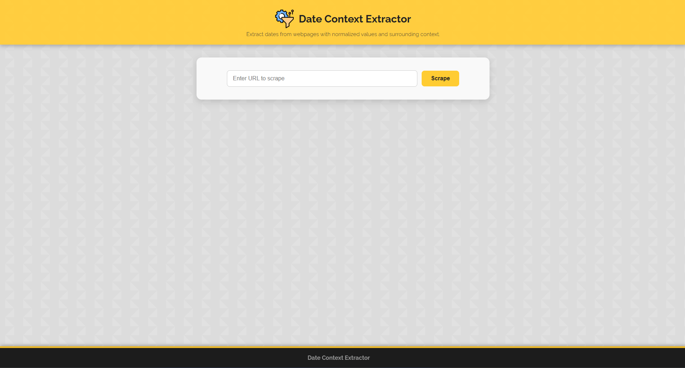
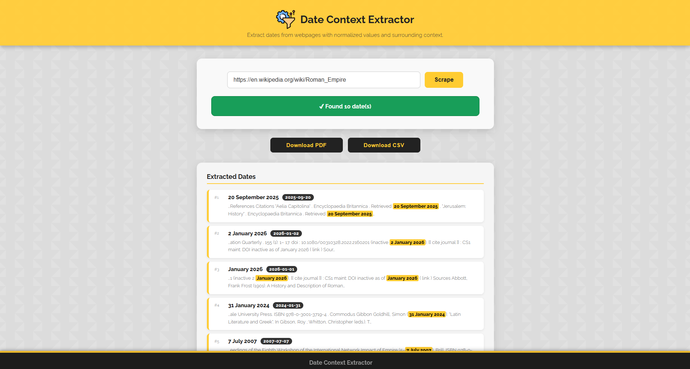
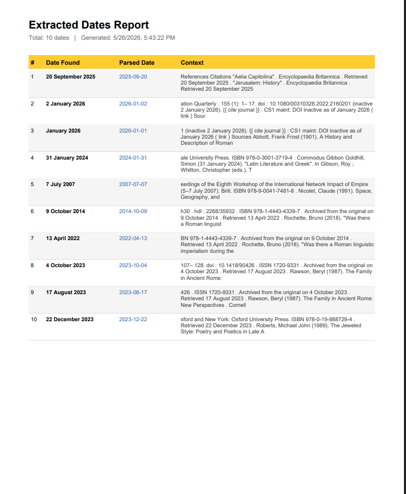
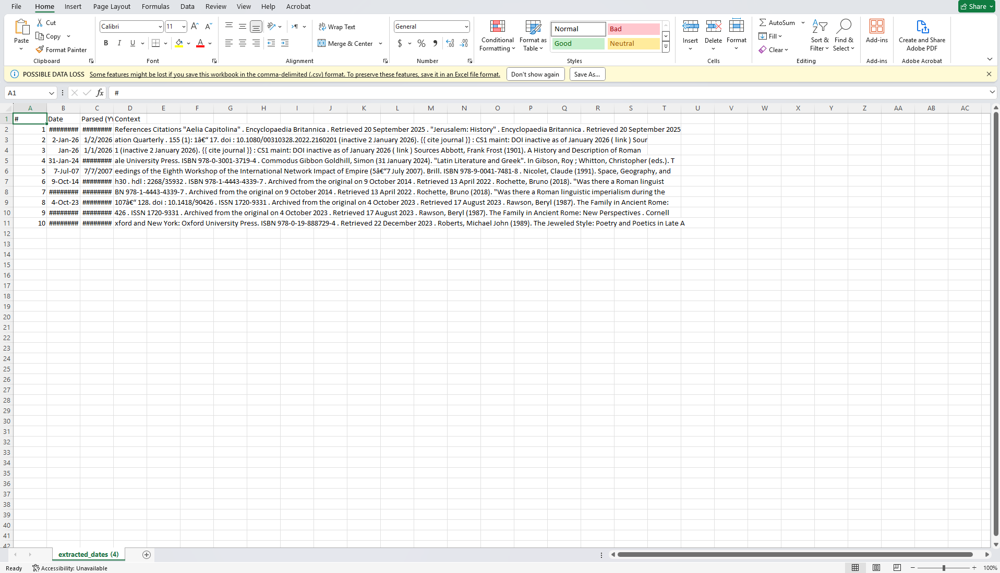

# Date Context Extractor

A Flask web app that extracts dates from webpages and returns each date with a normalized value and nearby text context. The scraper reads page text, HTML metadata, and JSON-LD structured data, then presents results in a browser interface with CSV and PDF export.

## Live App

https://date-context-extractor.onrender.com

## Features

- Extracts common date formats from webpage text.
- Normalizes parsed dates into `YYYY-MM-DD` format.
- Captures nearby text around each detected date.
- Reads date values from HTML meta tags.
- Detects `datePublished`, `dateModified`, and `dateCreated` from JSON-LD.
- Removes noisy page sections before extraction.
- Includes cleanup rules that improve extraction from Wikipedia-style articles.
- Supports optional Selenium fetching for dynamic pages.
- Exports extracted results as CSV or PDF from the frontend.

## Sample Page

Try this page in the app:

```text
https://en.wikipedia.org/wiki/Roman_Empire
```

The page contains many historical dates, which makes it useful for checking extraction quality and surrounding context.

## Tech Stack

| Part | Tech |
| --- | --- |
| Language | Python |
| Web framework | Flask |
| HTML parsing | BeautifulSoup |
| Date parsing | dateparser |
| HTTP fetching | requests |
| Dynamic pages | Selenium, webdriver-manager |
| Frontend | HTML, CSS, JavaScript |


## Screenshots

### Home



### Extracted Results



### PDF Export



### CSV Export



## Project Structure

```text
.
|-- app/
|   |-- app.py                 # Flask app and scraping endpoints
|   |-- templates/
|   |   `-- index.html         # Main browser UI
|   `-- static/
|       |-- css/               # Page styling
|       |-- js/script.js       # UI actions and exports
|       `-- icon.png
|-- requirements.txt           # Python dependencies
|-- render.yaml                # Render deployment config
`-- README.md
```

## Install Dependencies

Create and activate a virtual environment:

```bash
python -m venv venv
```

Windows:

```bash
venv\Scripts\activate
```

macOS/Linux:

```bash
source venv/bin/activate
```

Install dependencies:

```bash
pip install -r requirements.txt
```

## Run Locally

```bash
python app/app.py
```

Open:

```text
http://127.0.0.1:5000
```

## API Usage

Extract dates from a URL:

```text
GET /scrape?url=https://en.wikipedia.org/wiki/Roman_Empire
```

Use Selenium for a dynamic page:

```text
GET /scrape?url=https://example.com&dynamic=1
```

Example response:

```json
{
  "dates": [
    {
      "date": "January 2023",
      "parsed": "2023-01-01",
      "context": "surrounding page text for the extracted date"
    }
  ],
  "total": 1
}
```

## Deployment

The repo includes `render.yaml` for Render.

```text
Build command: pip install -r requirements.txt
Start command: gunicorn app.app:app
```
